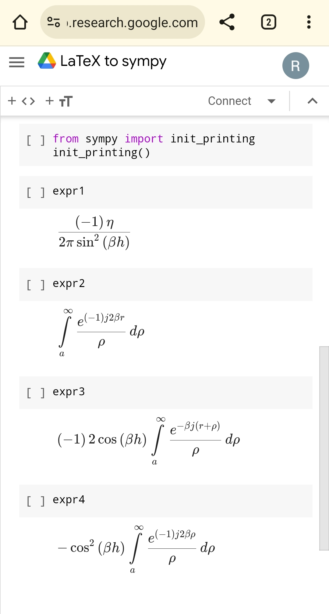

# LaTeX2sympy
LaTeX expression to sympy expression 

At `LaTeX_to_sympy.ipynb` is below operation:

From LaTeX expressions:
```
\frac{-\eta}{2 \pi \sin ^2 \beta h}
\int_a^{\infty} \frac{e^{-j 2 \beta r}}{\rho} d \rho
-2 \cos \beta h \int_a^{\infty} \frac{e^{-j \beta(r+\rho)}}{\rho} d \rho
-\cos ^2 \beta h \int_a^{\infty} \frac{e^{-j 2 \beta \rho}}{\rho} d \rho
```

To sympy expressions:
```
(-eta)/((2*pi*sin(beta*h)**2))
Integral(exp(-1*j*2*beta*r)/rho, (rho, a, oo))
-1*2*cos(beta*h)*Integral(exp(-beta*j*(r + rho))/rho, (rho, a, oo))
-cos(beta*h)**2*Integral(exp(-1*j*2*beta*rho)/rho, (rho, a, oo))
```


